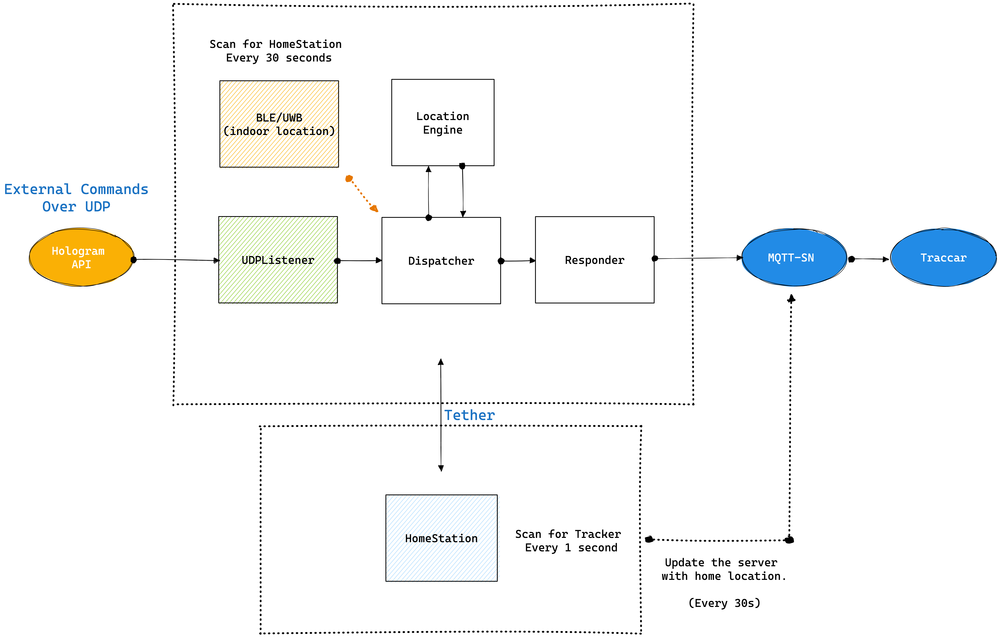

# Embedded Software

This is a mono-repository which contains the code for `outdoor-location-engine`, `indoor-location-engine` and `homestation` which are located under `packages/` sub directory.

### Targets
`outdoor-location-engine`: NRF-9160 on device PCB

`indoor-location-engine`: DWM3001C on device PCB

`homestation`: NRF-52833 + NRF-7002 on homestation PCB.

### Development
If you indend to develop the firmware for FindMyCat, it is recommended to use the `NRF-9160DK`, `DWM-3001CDK` and `NRF-7002DK` for the above repositories respectively.

### Architecture Overview

Please find the latest documentation on the official engineering documentation page: https://findmycat.io/docs