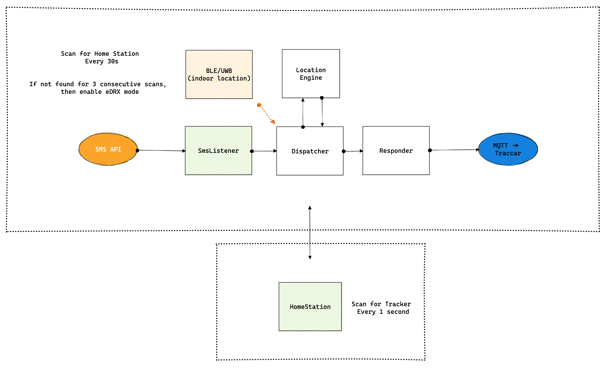

# FindMyCat - Outdoor Location Engine

Hardware: nrf9160-DK

Software Architecture:




## Getting Started

### Step 1 — Install the nRF Connect SDK

1. Download and install [nRF Connect for Desktop](https://www.nordicsemi.com/Products/Development-tools/nRF-Connect-for-Desktop)
2. Open the **Toolchain Manager** app inside it
3. Install **nRF Connect SDK v2.3.0**

You only need to do this once.

### Step 2 — Set up your terminal

Run this every time you open a new terminal to work on this project:

```bash
source scripts/env.sh
```

This sets the environment variables `west` needs to find the SDK and compiler.

### Step 3 — Build

```bash
west build -b nrf9160dk_nrf9160_ns
```

### Step 4 — Flash to the board

Plug in your nRF9160-DK via USB, then:

```bash
west flash
```

### Troubleshooting

**Build fails with a cmake cache error** — do a clean build:
```bash
west build -b nrf9160dk_nrf9160_ns --pristine
```

**`west: command not found`** — you forgot to source the env:
```bash
source scripts/env.sh
```

---

### Editor setup (Neovim + clangd)

For LSP support (autocomplete, go-to-definition, inline errors), clangd needs a
`compile_commands.json` generated from the build. Run this once after cloning:

```bash
source scripts/env.sh
west build -b nrf9160dk_nrf9160_ns -- -DCMAKE_EXPORT_COMPILE_COMMANDS=ON
```

The `.clangd` config file is already committed — clangd will pick everything up automatically after that.

## MQTT Data format
When sending data over mqtt the following format is used to send a comma separated string to save as much data as possible.

latitude,longitude,satellites_tracked,accuracy
